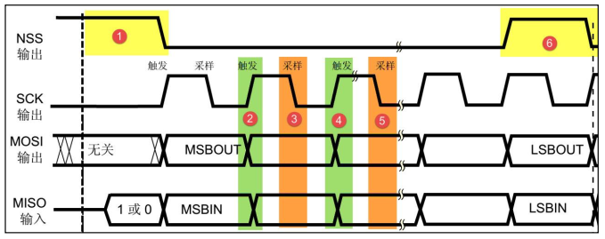

---

---

#  STM32学习笔记(十二)---SPI

[TOC]

## SPI协议

### 物理层

SPI通信的物理结构


SPI通信使用3条总线及片选线：SCK、MOSI、MISO及SS

1. SS（Slave Select）：从设备选择信号线，常称为**片选信号线**，也称为NSS、CS。每个从设备都会有一条独立的片选信号线。当主机要选择从设备时，将该从设备的片选信号线设置为低电平，该从设备即被选中。<u>SPI通讯以SS线置位低电平为开始信号，以SS线置位高电平作为结束信号。</u>
2. SCK（Serial Clock）：时钟信号线，用于数据同步。**它由通讯主机产生，决定了通信的速度**，不同的设备支持的最高时钟频率不一样，通讯过程中通讯速率受限于低速设备。
3. MOSI（Master Output，Slave Input）：主设备输出/从设备接收引脚。
4. MISO（Master Input，Slave Output）：主设备接收/从设备输出引脚。

### 协议层

SPI通讯时序



​       **MOSI和MISO的信号只有在NSS为低电平时才有效，在SCK的每个时钟周期MOSI和MISO传输一位数据。**

#### 1.通讯的起始和停止信号

图中的1表示起始信号：NSS由高电平变为低电平，表示从机被选中。

图中的6表示停止信号：NSS由低电平变为高电平，表示选中状态被取消。

#### 2. 数据有效性

MISO和MOSI信号线来传输数据，使用SCK信号线进行数据同步。**输入数据和输出数据是同时进行的。**MSB先行或LSB先行没有硬性规定，只需设备之间协调一致即可。**SPI每次数据传输可以8位或16位为单位，每次传输的单位数不受限制。**

#### 3. CPOL/CPHA及通讯模式

**SPI共有4种通讯模式，主要区别在于总线空闲时SCK的时钟状态以及数据采样的时刻。**

CPOL： 时钟极性，是指SPI通讯设备处于空闲时，SCK信号线的电平信号。

​              CPOL=0，SCK在空闲状态时为低电平。

​              CPOL=1，SCK在空闲状态时为高电平。

CPHA：时钟相位，是指数据的采样时刻。

​              CPHA = 0，数据线在SCK的奇数边沿被采样。

​              CPHA = 1，数据线在SCK的偶数边沿被采样


*CPHA = 0时的时序图：*


无论是CPOL=0还是CPOL=1，采样时刻都是在SCK的奇数边沿。非采样时刻，MISO和MOSI的有效信号才会发生切换。

*CHPA = 1时的时序图：*


无论是CPOL=0还是CPOL=1，采样时刻都是在SCK的偶数边沿。非采样时刻，MISO和MOSI的有效信号才会发生切换。

| SPI模式 | CPOL | CPHA | 空闲时刻SCK电平 | 采样时刻 |
| ------- | ---- | ---- | --------------- | -------- |
| 模式0   | 0    | 0    | 低电平          | 奇数边沿 |
| 模式1   | 0    | 1    | 低电平          | 偶数边沿 |
| 模式2   | 1    | 0    | 高电平          | 奇数边沿 |
| 模式3   | 1    | 1    | 高电平          | 偶数边沿 |

<u>实际中采用较多的是**模式0**和**模式3**</u>

## STM32 SPI

### STM32 SPI外设简介

1. 可作为通讯的主机或从机
2. 支持最高的SCK时钟频率为：ｆ(pclk)/2
3. 数据帧长度可设置为8位或16位，可设置数据MSB先行或LSB先行。
4. 支持 双线全双工、双线单向及单线模式。

### STM32 SPI功能框图


1. 引脚

2. 时钟控制

   SCK的时钟信号由波特率发生器根据控制寄存器CR1中的BR[0:2]位控制。

3. 数据控制逻辑

   **发送数据：**<u>通过写”数据寄存器DR“把数据填充到发送缓冲区中，然后通过数据移位寄存器将数据一位一位的通过数据线发送出去。</u>

   **接收数据：**<u>接收数据时，数据移位寄存器把数据线采集到的数据一位一位地存储到接收缓冲区中，通过读“数据寄存器DR”获取接收缓冲区的内容。</u>

4. 控制逻辑

### SPI 初始化结构体

```c
typedef struct
{
  uint16_t SPI_Direction;      //设置单双向模式
  uint16_t SPI_Mode;           //设置主机/从机模式   
  uint16_t SPI_DataSize;       //设置数据帧长度，可选8/16位
  uint16_t SPI_CPOL;           //设置时钟极性
  uint16_t SPI_CPHA;           //设置时钟相位
  uint16_t SPI_NSS;            //设置NSS引脚由硬件控制还是软件控制  
  uint16_t SPI_BaudRatePrescaler;   //设置时钟分频因子 
  uint16_t SPI_FirstBit;       //设置MSB/LSB先行
  uint16_t SPI_CRCPolynomial;  //设置CRC校验的表达式
}SPI_InitTypeDef;
```


**注意：**只有通过SPI发送数据才会产生SCK时钟。因此在读数据时必须先发送一个数据。